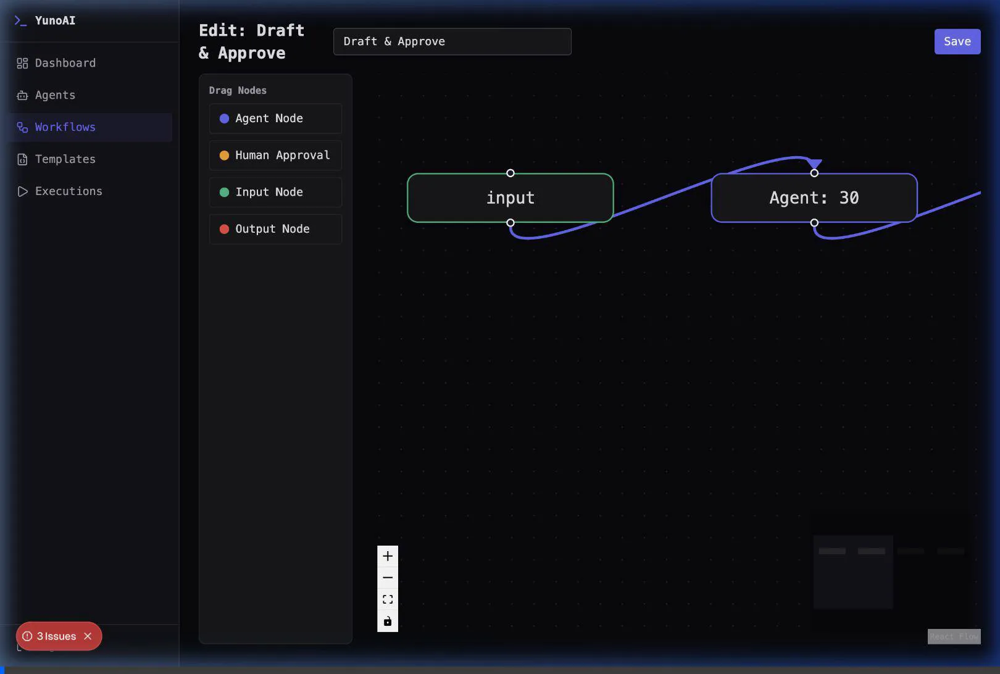
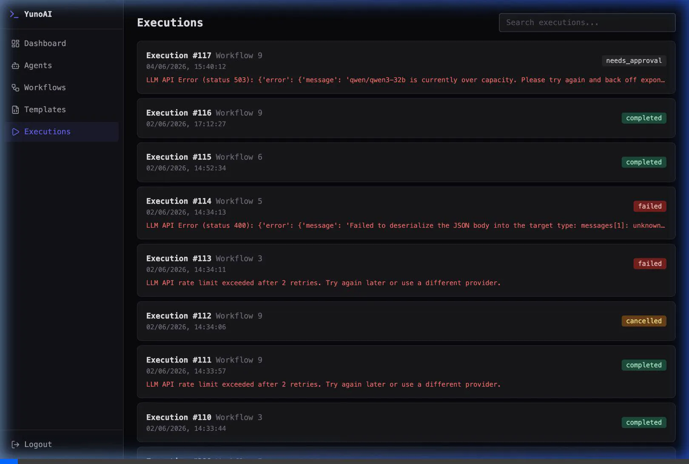
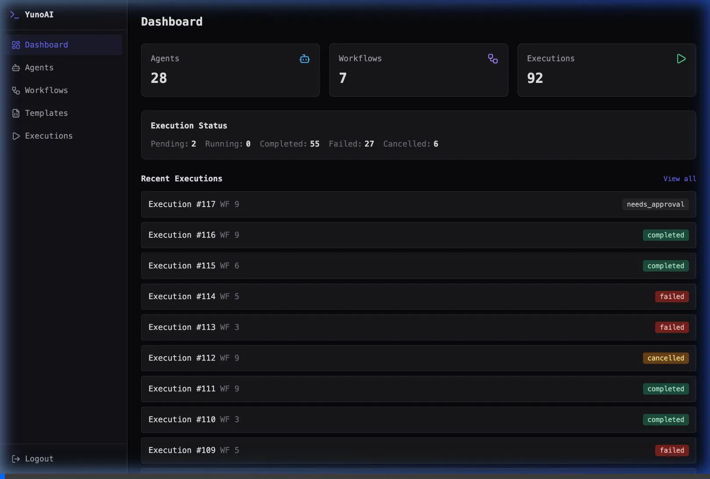
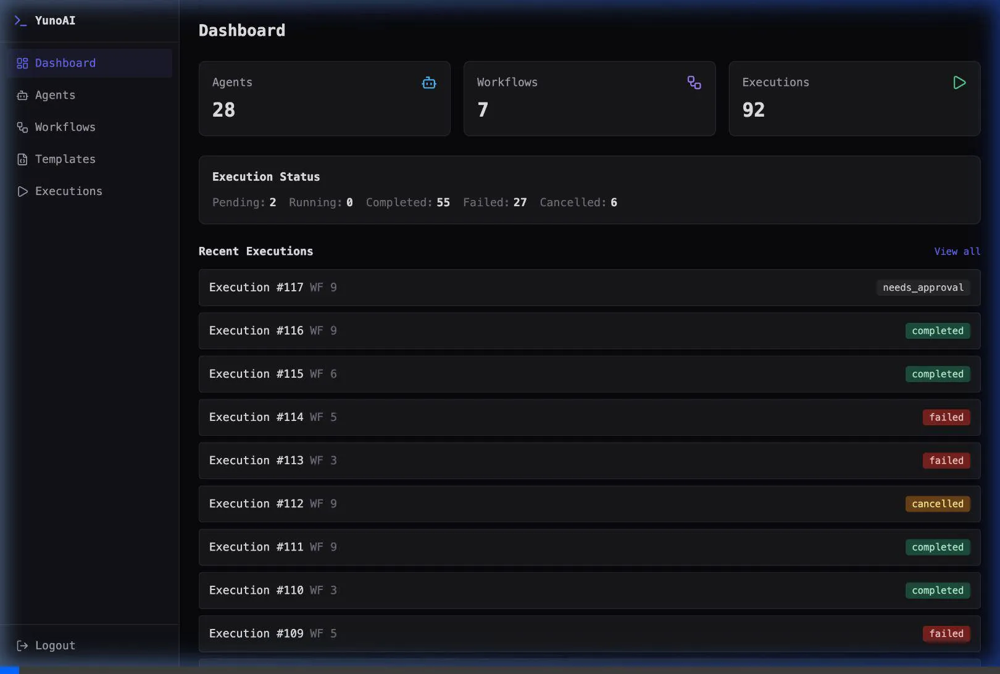

# YunoAI — Multi-Agent Orchestration Platform

A platform for creating AI agents, configuring their behavior, and connecting them into collaborative workflows with a visual builder, real-time monitoring, and external messaging channel integration.

## Key Features

- **Visual Workflow Builder**: Drag-and-drop React Flow canvas to build sequential or branching agent pipelines.
- **Multi-Provider LLM Fallback**: High availability with automatic cascading failovers and quota-aware routing across Groq, Gemini, DeepSeek, OpenAI, and Anthropic.
- **Real-Time Execution Monitoring**: SSE (Server-Sent Events) live log for watching workflows run in real time.
- **Human-in-the-loop Approval**: Pause executions for human review and resume conditionally.
- **Dynamic Telegram Integration**: Connect a Telegram bot via the dashboard settings to trigger workflows and chat with agents directly from Telegram.
- **Advanced Agent Configuration**: Configure tools, skills, schedules, memory persistence, and strict interaction guardrails.

## Demo

### End-to-End Workflow


### Visual Workflow Builder


### Execution Monitoring


### Agent Configuration


### Real-Time Dashboard


## Architecture

```
Frontend (Next.js)  <──REST / SSE──>  Backend (Django API)  <──Celery/Redis──>  LangGraph Engine (LLMs)
```

1. **Trigger**: Workflows are initiated via the UI or Telegram.
2. **Execution**: A Celery worker processes the workflow using the LangGraph engine.
3. **Routing**: Agents make LLM calls; conditional edges route the graph based on their outputs.
4. **Monitoring**: Frontend native `EventSource` connects to the backend to stream live updates.

## Quick Start

### Prerequisites
- Python 3.12+
- Node.js 20+
- Redis
- PostgreSQL (or SQLite for development)

### Setup

```bash
# Clone and enter the project
cd yunoai

# 1. Setup the project (installs dependencies, migrates DB, seeds demo data)
./setup.sh

# 2. Start all services (Django, Celery, Telegram Bot, Next.js Frontend)
./run.sh
```

### Initial Configuration

1. Create a superuser to log into the dashboard:
   ```bash
   python manage.py createsuperuser
   ```
2. Navigate to `http://localhost:3000/settings` in the frontend and input your Telegram Bot API Token. The backend will automatically restart and begin polling Telegram.

## Testing

```bash
# Backend (Pytest)
cd backend && pytest

# Frontend (Vitest)
cd frontend && npm test
```
